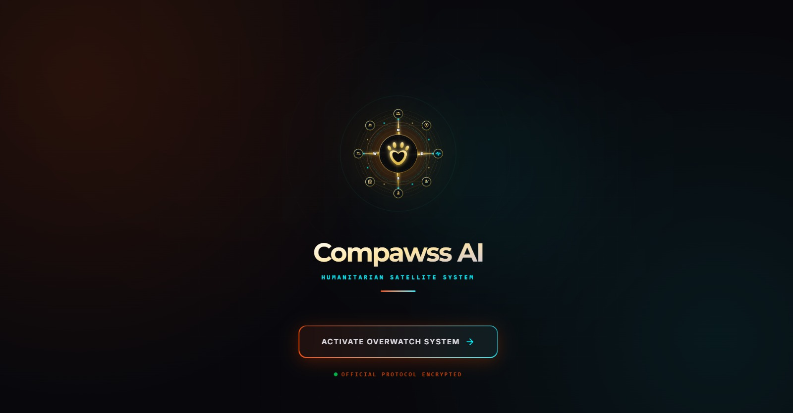
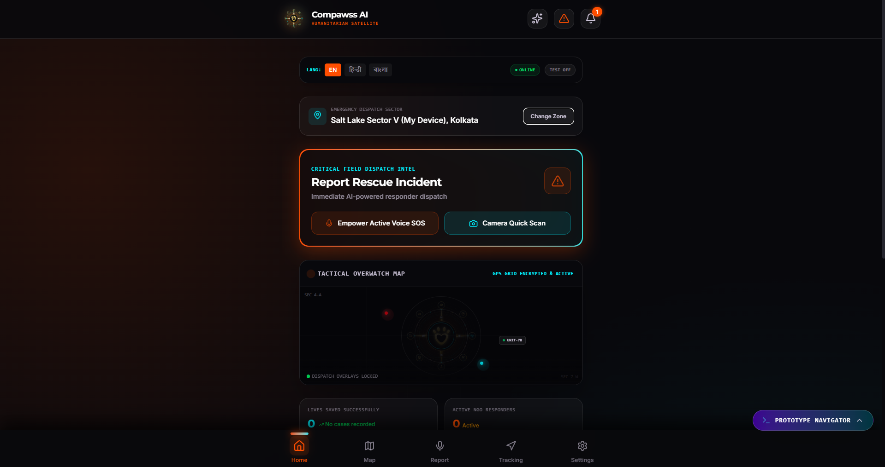

<div align="center">

# 🐾 Compawss AI

### AI-Powered Humanitarian Animal Rescue Platform

*A futuristic tactical rescue system combining cutting-edge AI with real-time coordination to save animal lives*

[](LICENSE)
[](https://reactjs.org/)
[](https://www.typescriptlang.org/)
[](https://fastapi.tiangolo.com/)
[](https://github.com/yooniqx/Compawss-ai)

**Created by [Debopriya Bose](https://github.com/yooniqx)**

[Features](#-features) • [Screenshots](#-screenshots) • [Tech Stack](#-tech-stack) • [Setup](#-quick-start) • [Architecture](#-architecture)

</div>

---

## 📸 Screenshots

### Landing Page - Tactical Rescue Terminal
<div align="center">


*Cyberpunk-inspired landing interface with animated orbital navigation system*
</div>

### Home Dashboard - Emergency Dispatch Center
<div align="center">


*Real-time rescue command center with GPS tracking, multilingual support, and tactical map overlay*
</div>

---

## 🌟 Features

### 🚨 Emergency Response System
- **AI-Powered Injury Analysis** - Real-time image analysis using Google Gemini AI to assess animal injuries and provide immediate medical guidance
- **Voice-Activated SOS** - Hands-free emergency reporting with voice recording and transcription
- **Camera Quick Scan** - Instant injury detection through image capture and AI analysis
- **GPS Location Tracking** - Automatic geolocation for accurate rescue coordination
- **Multilingual Support** - Interface available in English, Hindi, and Bengali for wider accessibility

### 🏥 Rescue Coordination
- **Tactical Overwatch Map** - Real-time Google Maps integration showing nearby veterinary clinics, NGOs, and foster homes
- **Smart Resource Discovery** - Intelligent search using Google Places API to find animal welfare organizations within 15km radius
- **One-Click Navigation** - Direct Google Maps integration for "View on Map" and "Get Directions" functionality
- **Live Dispatch Status** - Track active rescue operations and responder availability
- **Incident History** - Complete rescue operation logs with timestamps and outcomes

### 💬 AI Assistant
- **Conversational AI Guidance** - Context-aware assistance powered by Google Gemini for rescue operations and animal care
- **Grounded Knowledge Base** - Specialized veterinary and rescue protocol information
- **Multi-turn Conversations** - Maintains context across chat sessions for complex queries
- **Emergency Protocol Advisor** - Step-by-step guidance for critical situations

### 🎨 User Experience
- **Cyberpunk Tactical UI** - Futuristic rescue terminal aesthetic with animated overlays and scanner-like diagnostics
- **Dark/Light Mode** - Fully functional theme switching with proper contrast optimization
- **High Contrast Mode** - Enhanced readability for accessibility
- **Dynamic Text Scaling** - Adjustable text size (1-5 scale) for better visibility
- **Color Deficit Filters** - Support for Protanopia, Deuteranopia, and Tritanopia
- **Audio Haptics** - Tactile feedback for button presses and alerts
- **Voice Commands** - Hands-free navigation capability
- **Responsive Design** - Optimized for mobile rescue operations

---

## 🏗️ Tech Stack

### Frontend Architecture
```
React 18 + TypeScript + Vite
├── UI Framework: Tailwind CSS
├── Animations: Framer Motion
├── State Management: React Context API
├── Routing: React Router (screen-based navigation)
└── Icons: Lucide React
```

**Key Libraries:**
- **React 18** - Modern UI with concurrent features
- **TypeScript** - Type-safe development
- **Vite** - Lightning-fast build tool and dev server
- **Tailwind CSS** - Utility-first styling with custom design system
- **Framer Motion** - Smooth animations and transitions
- **Google Maps JavaScript API** - Real-time geolocation and mapping
- **Supabase Client** - Real-time database and authentication

### Backend Architecture
```
FastAPI (Python 3.8+)
├── AI Engine: Google Gemini 1.5 Flash
├── Knowledge Base: Grounded AI with custom protocols
├── Location Services: Google Places API
├── Database: Supabase (PostgreSQL)
└── API Documentation: OpenAPI/Swagger
```

**Key Technologies:**
- **FastAPI** - High-performance async Python framework
- **Google Gemini AI** - Advanced multimodal AI for image analysis and chat
- **Supabase** - PostgreSQL database with real-time subscriptions
- **Google Places API** - Location-based services for resource discovery
- **Pydantic** - Data validation and settings management

### Infrastructure
- **Frontend Hosting:** Vercel/Netlify (recommended)
- **Backend Hosting:** Render
- **Database:** Supabase Cloud (PostgreSQL)
- **CDN:** Cloudflare (optional)
- **Monitoring:** Sentry (optional)

---

## 🚀 Quick Start

### Prerequisites

Ensure you have the following installed:
- **Node.js** v16+ ([Download](https://nodejs.org/))
- **Python** 3.8+ ([Download](https://www.python.org/))
- **Git** ([Download](https://git-scm.com/))

You'll also need API keys from:
- [Google AI Studio](https://aistudio.google.com/app/apikey) - For Gemini AI
- [Google Cloud Console](https://console.cloud.google.com/) - For Maps & Places APIs
- [Supabase](https://supabase.com/) - For database

### 1️⃣ Clone the Repository

```bash
git clone https://github.com/yourusername/compawss-ai.git
cd compawss-ai
```

### 2️⃣ Frontend Setup

```bash
# Install dependencies
npm install

# Create environment file
cp .env.example .env.local

# Edit .env.local with your credentials
# VITE_BACKEND_URL=http://localhost:8000
# VITE_SUPABASE_URL=your_supabase_url
# VITE_SUPABASE_ANON_KEY=your_supabase_anon_key
# VITE_GOOGLE_MAPS_API_KEY=your_google_maps_api_key

# Start development server
npm run dev
```

Frontend will be available at `http://localhost:5173`

### 3️⃣ Backend Setup

```bash
# Navigate to backend directory
cd backend

# Install Python dependencies
pip install -r requirements.txt

# Create environment file
cp .env.example .env

# Edit backend/.env with your credentials
# GEMINI_API_KEY=your_gemini_api_key
# SUPABASE_URL=your_supabase_url
# SUPABASE_ANON_KEY=your_supabase_anon_key
# SUPABASE_SERVICE_ROLE_KEY=your_service_role_key
# GOOGLE_PLACES_API_KEY=your_places_api_key
# GOOGLE_MAPS_PLATFORM_KEY=your_maps_api_key

# Run the backend server
python main_grounded.py
```

Backend will be available at `http://localhost:8000`

### 4️⃣ Database Setup

1. Create a Supabase project at [supabase.com](https://supabase.com)
2. Run the SQL schema from `supabase-schema.sql` in the Supabase SQL editor
3. Copy your project URL and keys to the environment files

---

## 📁 Project Structure

```
compawss-ai/
├── src/
│   ├── components/
│   │   ├── screens/              # Main application screens
│   │   │   ├── Splash.tsx        # Landing page with orbital animation
│   │   │   ├── Home.tsx          # Dashboard, SOS, Notifications, AI Chat
│   │   │   ├── RescueCommand.tsx # Map, NGO Dashboard, Offline Mode
│   │   │   ├── InjuryAnalysis.tsx # Voice Report, Injury Scan, Vet Dashboard
│   │   │   ├── Dashboards.tsx    # Foster, Volunteer, Owner Dashboards
│   │   │   └── AccessibilitySettings.tsx # User preferences
│   │   ├── CompawssLogo.tsx      # Animated orbital logo component
│   │   ├── Header.tsx            # Top navigation bar
│   │   ├── Navbar.tsx            # Bottom navigation menu
│   │   └── ProtoConsole.tsx      # Prototype navigation overlay
│   ├── context/
│   │   ├── ChatContext.tsx       # AI chat state management
│   │   └── RescueContext.tsx     # Rescue operations state
│   ├── services/
│   │   ├── aiService.ts          # Backend API communication
│   │   ├── apiService.ts         # Google Maps & Places integration
│   │   ├── googleMapsLoader.ts   # Dynamic Maps API loader
│   │   └── supabaseClient.ts     # Database client
│   ├── types.ts                  # TypeScript type definitions
│   ├── data.ts                   # Static data and constants
│   ├── demoData.ts               # Demo data for testing
│   ├── App.tsx                   # Main application component
│   ├── main.tsx                  # Application entry point
│   └── index.css                 # Global styles and themes
├── backend/
│   ├── main_grounded.py          # Production backend with real AI
│   ├── main.py                   # Legacy backend (deprecated)
│   ├── knowledge_base.py         # Grounded AI knowledge system
│   ├── requirements.txt          # Python dependencies
│   └── README.md                 # Backend documentation
├── public/                       # Static assets
├── .env.example                  # Environment variable template
├── supabase-schema.sql           # Database schema
├── package.json                  # Node.js dependencies
├── tsconfig.json                 # TypeScript configuration
├── vite.config.ts                # Vite build configuration
├── tailwind.config.js            # Tailwind CSS configuration
└── README.md                     # This file
```

---

## 🔧 Configuration

### Environment Variables

#### Frontend (`.env.local`)

| Variable | Description | Required | Example |
|----------|-------------|----------|---------|
| `VITE_BACKEND_URL` | Backend API endpoint | ✅ | `http://localhost:8000` |
| `VITE_SUPABASE_URL` | Supabase project URL | ✅ | `https://xxx.supabase.co` |
| `VITE_SUPABASE_ANON_KEY` | Supabase anonymous key | ✅ | `eyJhbGc...` |
| `VITE_GOOGLE_MAPS_API_KEY` | Google Maps JavaScript API key | ✅ | `AIzaSy...` |

#### Backend (`backend/.env`)

| Variable | Description | Required | Example |
|----------|-------------|----------|---------|
| `GEMINI_API_KEY` | Google Gemini AI API key | ✅ | `AIzaSy...` |
| `SUPABASE_URL` | Supabase project URL | ✅ | `https://xxx.supabase.co` |
| `SUPABASE_ANON_KEY` | Supabase anonymous key | ✅ | `eyJhbGc...` |
| `SUPABASE_SERVICE_ROLE_KEY` | Supabase service role key | ✅ | `eyJhbGc...` |
| `GOOGLE_PLACES_API_KEY` | Google Places API key | ✅ | `AIzaSy...` |
| `GOOGLE_MAPS_PLATFORM_KEY` | Google Maps Platform key | ✅ | `AIzaSy...` |

### API Key Setup

#### Google Cloud Console
1. Enable **Maps JavaScript API**
2. Enable **Places API (New)**
3. Enable **Gemini API** (via AI Studio)
4. Create API keys with appropriate restrictions
5. Add HTTP referrer restrictions for frontend keys
6. Add IP restrictions for backend keys

#### Supabase
1. Create a new project
2. Copy the project URL and anon key
3. Generate a service role key from Settings > API
4. Run the database schema from `supabase-schema.sql`

---

## 🚢 Deployment

### Deploy Backend to Render

1. **Push code to GitHub**
   ```bash
   git add .
   git commit -m "Prepare for deployment"
   git push origin main
   ```

2. **Create new Web Service on Render**
   - Connect your GitHub repository
   - Set build command: `pip install -r requirements.txt`
   - Set start command: `python main_grounded.py`
   - Add environment variables from `backend/.env`

3. **Configure environment**
   - Add all required environment variables
   - Set Python version to 3.8+
   - Enable auto-deploy from main branch

### Deploy Frontend to Vercel

1. **Build production bundle**
   ```bash
   npm run build
   ```

2. **Deploy to Vercel**
   ```bash
   npm install -g vercel
   vercel --prod
   ```

3. **Configure environment**
   - Add all `VITE_*` environment variables
   - Update `VITE_BACKEND_URL` to your Render backend URL
   - Enable automatic deployments from GitHub

### Post-Deployment Checklist
- ✅ Test all API endpoints
- ✅ Verify Google Maps integration
- ✅ Check AI chat functionality
- ✅ Test image upload and analysis
- ✅ Verify database connections
- ✅ Test geolocation services
- ✅ Check mobile responsiveness

---

## 🏛️ Architecture

### System Overview

```
┌─────────────────────────────────────────────────────────────┐
│                     Compawss AI Platform                     │
├─────────────────────────────────────────────────────────────┤
│                                                               │
│  ┌──────────────┐         ┌──────────────┐                  │
│  │   Frontend   │◄───────►│   Backend    │                  │
│  │  React + TS  │  REST   │   FastAPI    │                  │
│  └──────┬───────┘         └──────┬───────┘                  │
│         │                        │                           │
│         │                        │                           │
│    ┌────▼────┐            ┌─────▼──────┐                   │
│    │ Google  │            │   Gemini   │                    │
│    │  Maps   │            │     AI     │                    │
│    └─────────┘            └────────────┘                    │
│         │                        │                           │
│         │                  ┌─────▼──────┐                   │
│         └─────────────────►│  Supabase  │                   │
│                            │ PostgreSQL │                    │
│                            └────────────┘                    │
└─────────────────────────────────────────────────────────────┘
```

### Data Flow

1. **User Interaction** → Frontend captures user input (voice, image, text)
2. **API Request** → Frontend sends request to FastAPI backend
3. **AI Processing** → Backend processes with Gemini AI
4. **Knowledge Grounding** → AI responses enhanced with veterinary protocols
5. **Database Storage** → Results stored in Supabase
6. **Real-time Updates** → Frontend receives updates via Supabase subscriptions
7. **Map Integration** → Google Maps displays rescue resources

---

## 🔐 Security & Privacy

### Security Measures
- ✅ Environment variables for all sensitive data
- ✅ API key restrictions (HTTP referrers, IP addresses)
- ✅ HTTPS-only communication in production
- ✅ Supabase Row Level Security (RLS) policies
- ✅ Input validation and sanitization
- ✅ Rate limiting on API endpoints

### Privacy Considerations
- 🔒 No personal data stored without consent
- 🔒 Image data processed securely via Gemini AI
- 🔒 Location data used only for rescue coordination
- 🔒 Chat history stored locally in browser
- 🔒 Optional anonymous usage mode

### Best Practices
- **Never commit** `.env` or `.env.local` files
- **Rotate API keys** if accidentally exposed
- **Use `.env.example`** as template only
- **Enable API restrictions** in Google Cloud Console
- **Monitor usage** via API dashboards
- **Regular security audits** of dependencies

---

## 🎯 Roadmap

### Phase 1: Core Features ✅
- [x] AI-powered injury analysis
- [x] Emergency SOS system
- [x] Real-time map integration
- [x] Conversational AI assistant
- [x] Multilingual support
- [x] Accessibility features

### Phase 2: Enhanced Coordination 🚧
- [ ] Real-time rescue team dispatch
- [ ] Live video streaming for remote assessment
- [ ] Multi-user collaboration tools
- [ ] Advanced analytics dashboard
- [ ] Mobile app (React Native)

### Phase 3: Community Features 📋
- [ ] Public rescue incident feed
- [ ] Volunteer coordination system
- [ ] Foster home matching algorithm
- [ ] Donation and fundraising integration
- [ ] Success story sharing platform

### Phase 4: AI Enhancements 🔮
- [ ] Predictive rescue analytics
- [ ] Automated incident categorization
- [ ] Multi-species injury recognition
- [ ] Treatment outcome prediction
- [ ] Resource optimization AI

---

## 🆘 Support & Contact

### Getting Help
- 📖 **Documentation:** Check this README and inline code comments
- 🐛 **Bug Reports:** [Open an issue on GitHub](https://github.com/yooniqx/Compawss-ai/issues)
- 💡 **Feature Requests:** [Open an issue](https://github.com/yooniqx/Compawss-ai/issues) with the `enhancement` label
- 📧 **Email:** [dbose0906@gmail.com](mailto:dbose0906@gmail.com)
- 👤 **Developer:** [Debopriya Bose (@yooniqx)](https://github.com/yooniqx)

### Known Issues
- Voice recording requires HTTPS in production
- GPS permissions must be granted for location features
- Image upload limited to 10MB per file
- Real-time updates require stable internet connection

---

## 📄 License

**Copyright © 2024 Debopriya Bose. All Rights Reserved.**

This project is **proprietary and confidential**. Unauthorized copying, distribution, modification, or use of this software, via any medium, is strictly prohibited without explicit written permission from the copyright holder.

### Terms
- ❌ **No Copying** - Source code may not be copied or reproduced
- ❌ **No Distribution** - Software may not be distributed or shared
- ❌ **No Modification** - Code may not be modified or adapted
- ❌ **No Commercial Use** - Software may not be used commercially
- ✅ **Viewing Only** - Code may be viewed for reference purposes only

For licensing inquiries, please contact: [dbose0906@gmail.com](mailto:dbose0906@gmail.com)

---

## 🙏 Acknowledgments

- **Google Gemini AI** - For advanced multimodal AI capabilities
- **Supabase** - For real-time database infrastructure
- **Google Maps Platform** - For geolocation services
- **React Community** - For excellent documentation and tools
- **Animal Welfare Organizations** - For inspiration and guidance

---

<div align="center">

**Built with ❤️ for animal welfare**

*Saving lives, one rescue at a time*

[⬆ Back to Top](#-compawss-ai)

</div>
